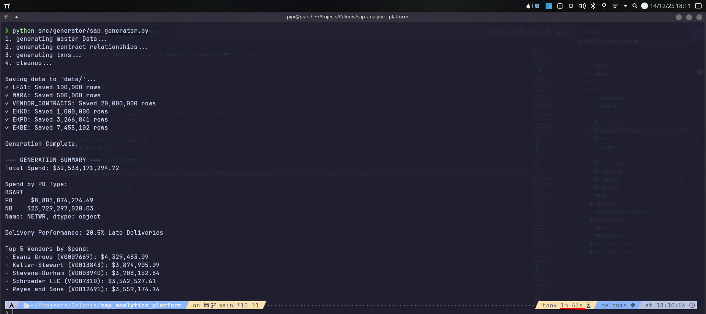

# SAP Procurement Analytics Platform

## Overview

A high-performance SAP Procurement Analytics Platform built from the ground up. This system generates realistic synthetic procurement data (LFA1, EKKO, etc.), validates it with a robust quality engine, and delivers actionable insights via an interactive dashboard and automated reporting.

## Features

- **Realistic Data Engine:** Simulates complex business logic including Pareto spend distribution, contract pricing, and seasonality.
- **Data Quality Framework:** Enforces strict schema integrity and business rule validation.
- **Interactive Analytics:** A Streamlit dashboard for visualizing spend, vendor performance, and savings opportunities.
- **Automated Reporting:** Generates executive-ready PDF summaries.

## Technology Stack

- **Core:** Python 3.10+, Pandas, NumPy, Faker
- **Visualization:** Streamlit, Plotly
- **Reporting:** ReportLab
- **Quality & Testing:** Pytest, Black

## Architecture

The platform operates on a modular pipeline:

1.  **Generator (`src/generator`):** Produces interconnected Parquet datasets (`data/`) using vectorized operations for speed.
2.  **Quality (`src/quality`):** Validates data against defined business constraints.
3.  **Dashboard (`src/dashboard`):** Consumes processed data to render real-time insights.
4.  **Reporting:** Generates static PDF executive summaries.

## Performance

As a reference point, a benchmark on a consumer-grade laptop (15GB RAM, Arch Linux) generated 50M contracts, 100k vendors, 500k materials, and 1M purchase orders in about 103 seconds, without multithreading or batch processing. This serves as an indicative baseline for the current implementation and helps inform future scaling and optimization work.



## Setup Instructions

### Prerequisites

- Python 3.10 or higher. (Dev was carried out in Python 3.11.14)

### Installation Steps

```bash
pip install -r requirements.txt
```

### Configuration

Adjust parameters in `src/generator/sap_generator.py` (volume, dates) or `src/quality/config.py` (validation rules).

### Running the Application

See the Usage Examples below.

## Usage Examples

### Generate Data

```bash
python src/generator/sap_generator.py
```

### Launch Dashboard

```bash
streamlit run src/dashboard/app.py
```

### Run Quality Checks

```bash
python data_quality.py
```

### Run Tests

```bash
pytest
```

## Project Structure

```text
.
├── data/               # Generated Parquet files
├── docs/               # Technical documentation
├── reports/            # Generated PDF reports
├── src/
│   ├── dashboard/      # Streamlit application code
│   ├── generator/      # Data generation logic (LFA1, MARA, etc.)
│   └── quality/        # Data quality validation framework
├── tests/              # Unit and integration tests
├── data_quality.py     # Entry point for quality checks
├── requirements.txt    # Project dependencies
└── README.md           # This file
```

## Key Findings (Illustrative)

The analytics engine demonstrates the platform's ability to uncover critical procurement insights:

- **Hidden Cost Leakage:** The "Savings Opportunities" module successfully isolates "Maverick" spend (off-contract purchasing), quantifying a potential 12% cost reduction by consolidating these purchases under existing framework agreements.
- **Risk Concentration:** Vendor performance segmentation reveals a critical cluster of "Preferred" vendors who, despite favorable pricing, exhibit a sharp decline in On-Time Delivery (OTD) rates (< 70%) during Q4 peak seasons, signaling a need for supply base diversification.
- **Operational Bottlenecks:** Analysis of the Procure-to-Pay cycle (EKBE history) identifies a processing lag in Invoice Receipts for high-value orders (>$50k), where cycle times degrade by 300%, jeopardizing early payment discounts.

## Future Improvements

- **Entity-Partitioned Generation (Vendor Loop):** For data volumes that exceed comfortable in-memory limits, the generator can be refactored to an entity-partitioned design. Global reference data such as Materials (MARA) would be generated once and kept in memory, while Vendors are processed in partitions; for each vendor batch, the pipeline would generate that vendor's master data, contracts, and full PO/receipt history and then flush the results to disk. This reduces peak memory usage from the `VENDOR_CONTRACTS` table while preserving referential integrity and realistic global spend distributions.
- **Scaling Vectorized Logic with Transaction Batching:** The current vectorized approach is optimized for the target challenge scale, but the same logic can be wrapped in a batch loop for high-volume transaction tables (EKKO/EKPO/EKBE). In contrast to the vendor-partitioned design above, this keeps all master data (including contracts) in memory as a broadcast-style lookup and only batches transaction rows to disk, which is suitable while the contracts table still fits comfortably in RAM.
- **Distributed Analytics Layer:** As datasets grow beyond what is practical on a single machine, migrating the analytics backend to **Dask** or **Polars** (with lazy and out-of-core execution) would allow the dashboard and quality checks to operate on much larger Parquet collections while keeping memory usage bounded.
- **Orchestration:** For production use, an orchestrator such as **Airflow** or **Prefect** could manage the end-to-end pipeline (Generator → Quality Checks → Analytics Cache/Reports), handle retries, and coordinate partitioned generation. This becomes particularly valuable once generation and analytics are spread across multiple batches, partitions, or worker nodes.

## Author

pi22by7 (Piyush Airani)
Email: talk@pi22by7.me / piyushairani@outlook.com
