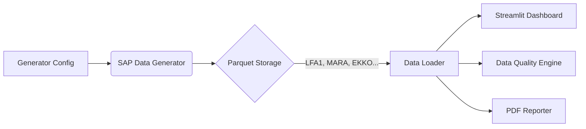

# System Architecture

This document describes the high-level architecture of the SAP Procurement Analytics Platform, detailing the data flow, component interaction, and scalability strategies.

## High-Level Overview

The system follows a linear **Extract-Load-Transform (ELT)** pipeline pattern, decoupled into three distinct layers:

1.  **Generation Layer:** Synthetic data creation engine.
2.  **Storage Layer:** File-based persistence (Parquet).
3.  **Presentation Layer:** Interactive analytics dashboard.

## 1. Generation Layer (`src/generator`)
*   **Core Component:** `SAPDataGenerator` class.
*   **Methodology:** Vectorized NumPy operations for high-performance generation of interconnected datasets.
*   **Dependency Management:** Enforces strict generation order to maintain referential integrity:
    1.  Master Data (LFA1, MARA)
    2.  Relationships (Contracts)
    3.  Transactions (EKKO -> EKPO -> EKBE)

## 2. Storage Layer (`data/`)
*   **Format:** Apache Parquet (Columnar storage).
*   **Rationale:** Parquet was chosen over CSV for:
    *   **Type Preservation:** Maintains native data types (dates, floats) without parsing overhead.
    *   **Compression:** Reduces disk footprint for large datasets.
    *   **Read Speed:** Optimized for analytical queries (reading subsets of columns).

## 3. Presentation Layer (`src/dashboard`)
*   **Framework:** Streamlit.
*   **Data Access:** `data_loader.py` utilizes `@st.cache_data` to load Parquet files into memory once per session, ensuring sub-second interaction latency.
*   **Architecture:**
    *   **`app.py`:** Entry point and global state manager (filtering).
    *   **`pages/`:** Modular page logic (Overview, Savings, Performance).
    *   **`components.py`:** Reusable UI widgets (KPI cards, charts).

## Scalability Strategy

### Current State (In-Memory Broadcast)
The current implementation holds Master Data (Contracts, Vendors) in memory to perform fast lookups during transaction generation. This is efficient for datasets up to ~500MB (approx. 2M contracts).

### Future State (Entity Partitioning)
To scale to Terabytes of data (e.g., 100M+ contracts), the architecture is designed to support **Vendor Partitioning**:

1.  **Global Reference:** Keep only `MARA` (Materials) in memory.
2.  **Partition Loop:** Iterate through subsets of Vendors (e.g., 1,000 at a time).
3.  **Isolated Generation:** Generate Contracts and POs *only* for the active Vendor batch.
4.  **Flush:** Write to disk and clear RAM before the next batch.

This approach eliminates the memory ceiling imposed by the `VENDOR_CONTRACTS` table while preserving global statistical distributions (Pareto Principle) via pre-calculated weight maps.
